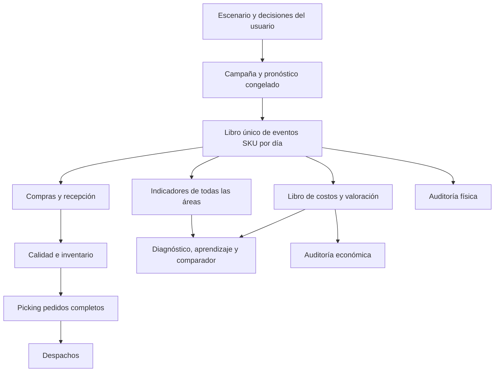
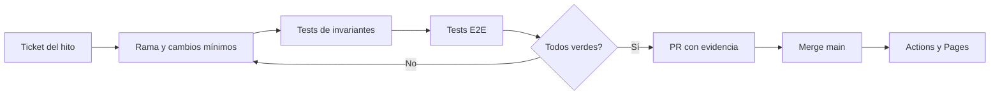

# Roadmap de cierre · Supply Chain Operations Lab

> Documento de ejecución. Revisado durante el incremento v11.13 (2026-10-09).
> Los porcentajes son estimaciones del alcance original; no equivalen a porcentaje
> de esfuerzo pendiente, ni certifican uso productivo.

## Objetivo verificable

Entregar un laboratorio didáctico de un centro de distribución donde una sola
campaña produce pedidos, compras, recepciones, retenciones de Calidad, inventario
y despachos coherentes con las mismas restricciones, con costos explicables.
No reemplaza WMS, ERP, planificador de transporte ni contabilidad de producción.

## Situación al iniciar v11.11

| Fase transversal | Referencia | Funcional | Deuda crítica |
| --- | ---: | --- | --- |
| 1. Motor agregado y economía | 85 % | Ocho áreas, restricciones y resultado didáctico de una jornada | Unificar unidad/horizonte/libro económico |
| 2. Demanda y recuperación | 89 % | Sorpresa y congelación de compras; alternativas | Recuperación contra un único registro operativo |
| 3. SKU e inventario | 94 % del laboratorio aislado | BOM, pedidos completos, plazos, parciales, calidad, conciliación SKU | Migración a fuente única de toda la campaña |
| 4. UX y aprendizaje | 86 % | Navegación, KPI, comparador, diagnóstico | Recorrido didáctico, accesibilidad y validación móvil |
| 5. QA y documentación | 76 % | 124 regresiones Node y Pages verde en v11.10 | E2E navegador, cobertura profunda y release final |

No interpretar el 94 % del laboratorio SKU como 94 % de la integración de motores.
Los porcentajes no son una métrica automática. La convergencia será validada con
criterios de aceptación explícitos, no con aumentos arbitrarios de porcentaje.

## Plan de implementación y definición de terminado

### M1. Puerta de calidad E2E con Chromium (prioridad P0)

**Entrega v11.11.** Automatizar desde un navegador verdadero el flujo
planificación de ocho áreas → diagnóstico con sorpresa → recuperación →
resultados → política SKU → auditoría → exportación → reinicio. Verificar
persistencia y ausencia de excepciones en dimensiones desktop y móvil.

**Pruebas:** test Node determinista existente sin regresiones; job
`Browser end-to-end smoke` verde en PR y rama main; capturas ante fallo.

**Aceptación:** navegación operativa, indicadores poblados, conciliación visible
y ningún error de JavaScript ni overflow de documento a 360/412 px.
La emulación Chromium NO sustituye validar físicamente Android TalkBack,
teclado táctil y navegadores propios del dispositivo.

### M2. Dominio canónico de la campaña (prioridad P0, depende de M1)

**Implementaciones parciales v11.12–v11.13:** v11.13 incorpora el contrato inmutable de decisiones entre las ocho áreas y la cohorte SKU, reutiliza la ejecución de recuperación entre informes y persiste un ID de campaña compatible con localStorage previo. Los motores siguen separados y el catálogo SKU aún tiene stock inicial independiente.

**Implementación parcial v11.12:** órdenes individuales con ID, eventos de recepción y Calidad, movimientos de inventario, envíos y snapshot inmutable auditado por SKU. Pendiente: contrato único de escenario agregado/SKU, traspaso de decisiones y almacenamiento local, e integración como única fuente para todas las áreas. No se declara M2 finalizado.

Crear un único objeto `campaign` con `campaignId`, pronóstico, pedido
original congelado, pedidos reales revelados, catálogo de SKU y
`orders`, `purchaseOrders`, `receipts`, `qualityLots`,
`inventoryMovements`, `shipments` y `dailyEvents`. Tipar con JSDoc
o migración gradual a TypeScript, validación en límites de entrada.

- Las cantidades usan **unidades físicas por SKU**, las órdenes usan **pedidos**,
  los tiempos usan **días de campaña**, los costos usan **CLP**.
- Las líneas de pedido enlazan SKU y cantidad exacta; no se infiere una
  equivalencia de una unidad por pedido.
- No modificar compra original tras revelar demanda.
- Cada evento tiene ID único, origen, día efectivo y cantidades validadas.
- Preservar importación/migración de decisiones persistidas en localStorage.

**Aceptación:** misma campaña y mismas decisiones producen eventos idénticos,
sin stock negativo, entregas anticipadas, pedidos duplicados ni compras
retroactivas. Pruebas con demanda 0/alta, múltiples BOM y recepciones parciales.

### M3. Operación integrada de ocho áreas (P0, depende de M2)

Convertir el motor SKU diario en fuente de verdad para ingresos, liberaciones
y despachos y adaptar `flow` como proyección/lectura, no motor paralelo.

- Comercial genera forecast; Planeación determina cantidades y cobertura;
  Compras confirma cantidades/lead time y cumplimiento por proveedor.
- Recepción utiliza capacidad diaria y cola física de bultos/unidades.
- Calidad retiene/librera lotes sin fingir rechazo; Inventario mantiene
  disponible/retención/restricción; Picking consume BOM completo.
- Transporte consume exactamente las órdenes preparadas y registradas.
- Las actividades que no tienen datos físicos suficientes se señalan como
  estimaciones y no se venden como hechos observados.

**Aceptación:** la traza por área coincide con eventos diarios,
`initial + received = dispatched + held + available` por SKU;
`requested = shipped + pending` por campaña; cero conteo duplicado.

### M4. Libro económico integrado y conciliación (P0, depende de M3)

Incorporar compras comprometidas, facturación/pagos **simulados y definidos
como supuesto** (o dejarlos expresamente sin modelar), costos operacionales,
costo estándar de mercancía, inventario final e ingresos de pedidos despachados.

- Separar resultado devengado simplificado, compromiso de compras y caja
  incremental. No llamar utilidad neta ni EBITDA a un proxy.
- Valorizar `stock inicial + entradas = despachos + stock disponible + retenido`.
- Distinguir costo unitario por SKU de costo por pedido completo.
- Costos de horas extra solo si la dotación/capacidad realmente se contrata
  según el escenario; supuestos de costos documentados y configurables.

**Aceptación:** conciliación por SKU y agregada sin doble sumar simulaciones,
invariante de costos cuando el escenario no cambia y tests de extremos.

### M5. Recuperación con decisiones congeladas (P1, depende de M3–M4)

Aplicar a un mismo registro operativo las cuatro alternativas de recuperación,
siempre desde el estado planificado congelado: esperar, capacidad adicional,
compra urgente y combinación. Comparar orden completada, atraso,
costo incremental, inventario retenido y resultado económico.

**Aceptación:** compras tardías nunca rescatan pedidos antes de la llegada;
una mejora bloqueada por otra área no crea despachos imaginarios;
reproducibilidad en cada re-ejecución.

### M6. Diagnóstico causal explicable (P1, depende de M5)

Evaluar impacto de una intervención por vez y combinaciones cuando dos
restricciones simultáneas impiden ver una ganancia individual. Distinguir
correlación, restricción física y causa raíz verificada.

**Aceptación:** cada recomendación explica decisión, contrafactual,
impacto físico/costo y limitaciones; ninguna suma impactos no aditivos.

### M7. UX didáctica accesible (P1, puede iterarse tras M1)

Ejercicios principiante/intermedio/avanzado; glosario KPI con unidades y
fórmula; tabla de eventos y explicación de errores frecuentes; navegación
semántica y teclado, aria-live y lectura móvil. Exportación de un resumen
reproducible sin datos personales.

**Aceptación:** uso completo en teléfono real, navegación por teclado,
etiquetas legibles, contrastes revisados y pruebas con usuarios del perfil
formativo. Chromium móvil es solo primer control, no certificación Android.

### M8. Estabilización, portafolio y publicación (P1, al completar M1–M7)

Suite unitaria, integrada, E2E, regresiones de inventario/finanzas y guía
operacional. README con limitaciones, instrucciones, versión y enlace
funcionales. Testear campañas de ejemplo y guardar resultados esperados.

**Aceptación:** las pruebas automáticas y la revisión manual se documentan,
el CI queda verde, se despliega Pages sin errores y se etiqueta la versión de
presentación. Pendientes conocidos explícitos, no ocultos.

## Arquitectura deseada

## Riesgos que deben controlarse

1. **Doble conteo:** nunca sumar `flow()` y `eventSimulation()` como si
   fueran procesos independientes dentro de la misma campaña.
2. **Granularidad temporal:** el motor agregado actual representa una jornada;
   SKU representa horizonte hasta 12 días. Acordar día 0/corte antes de
   integrar indicadores y resultados.
3. **Unidades incompatibles:** una unidad expedida no es un pedido completo.
4. **Compras versus efectivo:** obligación no equivale a pago, ni stock en
   tránsito es saldo de almacén.
5. **Pruebas:** no confundir tests Node o emulación de Pixel con QA física Android.

## Flujo de trabajo y puertas de calidad

El registro de hitos se revisará conforme se entreguen funciones verificadas;
no se elevarán avances sin evidencias de código, pruebas y despliegue.
